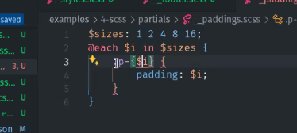

# Clase 2 

para ejecutar npm run dev te ejecuta el script de dev

pero con npx lo busca temporalmente para ejecutarlo

## Pre-procesadores de CSS

SASS es el mas usado actualmente.

Que es un pre-procesador: agiliza al escribir los estilos, permite anidar estilos
y lo transforma a codigo reducido

Añade caracteristicas dinamicas o funciones

pero hay que procesar cada vez que hacemos un cambio para obtener el CSS modificado
en angular te pregunta

# SASS
// comentario que no se compila 

/**/ que si se compila en el navegador

 # mirar a partir del minuto 30 
npm install sass --save-dev

"sass:dev": "sass --watch ejemplos/SCSS/styles.scss ejemplos/SCSS/dist/styles.css"

npm run sass:dev

esto seria nombre de la variable con el simbolo de dollar y nombre de la variable
$primary-color: #334;

npm i -D rimraf 
nos permite borrar archivos

sass styles.scss /dist/styles.css me pide ruby

con @import podemos importar un archivo entero 
ejemplo
@import 'partials/config';
se queda en ambito global

con @use podemos importar
con @forward podemos "copiar" css de otra carpeta

npm run sass:build

con porcentaje podemos luego extender de esas propiedades
%image{
    width:$image-w;
    height:auto;
}

@extend %image;

se tienen que declarar en el mismo archivo

# un mixin es una funcion

podemos por ejemplo en una variable 100vh*.3; y 
al compilar saldra 30vh

@each 

# WEbpack

un loader es una extension de webpack,  nos permite cargar un archivo del que cuelgan los demas
es un complemento o dependencia y lo incrusta en el html
el plugin hace algo mas

Un "module bundler" (en español, "empaquetador de módulos") es una herramienta de desarrollo de software que se utiliza para combinar diferentes módulos o archivos de código en un único archivo que pueda ser utilizado por una aplicación web o aplicación de software. Estos módulos pueden estar escritos en varios lenguajes de programación como JavaScript, TypeScript, CSS, entre otros.

El objetivo principal de un module bundler es simplificar la gestión de dependencias y optimizar el rendimiento de una aplicación al reducir el número de solicitudes HTTP necesarias para cargar la aplicación en el navegador o entorno de ejecución. Esto se logra al combinar todo el código de la aplicación en un solo archivo (o en varios archivos optimizados) que se pueda cargar de manera eficiente.
coje lo que queremos y nos lo optimiza para produccion minifica el codigo, imagenes y demas

pero vamos a usar 

# parcel
Es un bundler como webpack

## ¿Que necesitamos?
creamos una carpeta src
y metemos los html las img los js y los css

primeros pasos:

instalar parcel
npm i -D parcel

en packge.json

dev": "parcel src/index.html"
npm run dev 

nos puede dar varios errores porque no reconoce varios elementos porque va inspeciconando
todo el codigo y puede tener errores en las referencias porque el package.json
esta en un sitio diferente a la carpeta src

todas las rutas tienen que ser realativas y te va  dar errores aunque deberia avisarte
a mi hay algunas que no como las que estan dentro del css

lo que estamos haciendo es levantar un entorno de desarrollo en ese fichero
debes de poner la ruta que te da el server y no del live fijate 
en las rutas que tienen que ser diferentes normalmente las crea a traves de un hash

ponemos un rimraf para borrar archivos y directorios

archivos a gitignore
podemos poner en un source

en packge.json

podemos definir un entry point de nuestra aplicacion y ya no tenemos que
decirle la ruta de inicio en los scripts

"source": "src/index.html",
  "browserlist":">0.5%, last 2 version, not dead",

d
   
npm run build
  da un error al hacer un build porque en el package.json
  en main tenemos un index.js tenemos que eliminar la linea de codigo

aqui parcel ha tratado por ejemplo las imagenes y con la configuracion por defecto
las ha metido en la carpeta de dist donde hace que todo tiene lo que necsita la
aplicacion para funcionar

con esta linea parcel sabe lo que tiene que ahcer para que se ejecute en el navegador
"browserlist":">0.5%, last 2 version, not dead",

 "dev": "parcel --lazy ",
 solo carga las paginas o recursos cuando accedemos
"dev": "parcel --lazy --no-cache"

no utiliza la cache e entorno de desarrollo para evitar problemas o conflictos

# instalar dependencias prueba
instalamos la dependencia

importamos y la llamamos en una variable

parcel detecta un import de una libreria la intenta compilar
falla la palabra import porque al cargarlo en el html no es tipo module

parcel lo compila sin tener en cuenta si lo importamos si lo ponemos en un cnm

# imagenes
una de las mejores extensiones para imagenes web en webp
si pones en la imagen ?as=webp me instala sharp
y te lo convierte automaticamente

me ha dado error per al recargar npm run dev lo ha instalado y lo ha ejecutado correctamente
en las imagenes ./img/logo.png?as=webp o incluso ./img/logo.png?as=webp&quality=80
o &height  usamos los query params para cambiar como queramos

hace un reescalado automatico

# SCSS
en config adaptamos las variables
 y en main asignamos una a font family
 luego tendremos que decirle al html desde donde tiene que cargar este scss
 <link rel="stylesheet" href="./scss/main.scss">

 

